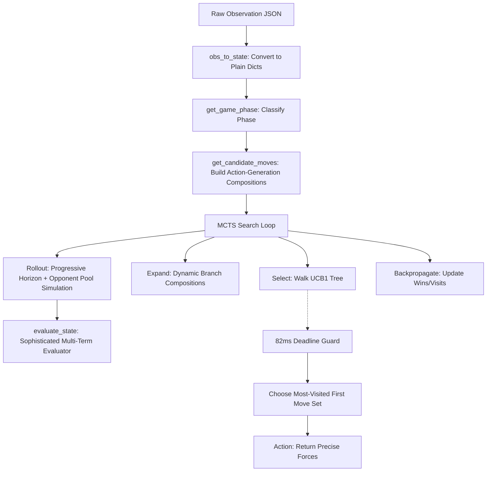

# Orbit Wars: Agent Architecture (V6 Overhaul)

## Project Structure

```
Ml_projects/
├── submission.py             ← SUBMIT THIS (V6 Agent: Action-Generation MCTS + Tactical Planning)
├── orbit_wars_notebook.ipynb ← UNIFIED SUBMISSION & TESTING NOTEBOOK (Cell 0 upgrades dependencies)
├── tune_eval.py              ← Phase 3 self-play weight tuning harness
├── architecture.md           ← This file (V6 architecture documentation)
├── README.md                 ← Competition rules
├── agents.md                 ← Submission guide
└── legacy_modules/           ← Previous modular files & old scripts (main.py, agent.py, train_rl.py)
```

---

## The V6 Architecture: Action-Generation & Tactical MCTS

The V6 agent represents a transition from a simple "policy-selection MCTS" to a true **Action-Generation and Combinatorial Search Agent**, combining deep tactical planning with precise force management, metagame modeling, and multi-term positional evaluation.



### 1. Zero-Corruption State Representation
To guarantee search integrity and eliminate silent tree contamination:
- **Strict Deep Copying (`copy_state`)**: State copies perform complete duplication of nested dictionaries and sets (`ips`, `comet_planet_ids`, and `moving`). This guarantees that rollout simulations never leak side-effects to the active search tree, ensuring MCTS searches are deterministic and error-free.

### 2. Action-Generation Candidate Compositions
Instead of choosing between static preset policies, V6 generates atomic moves for our planets and dynamically composes them into **6 high-quality, mutually-exclusive turn compositions**:
1. **Coordinated Heavy Attack**: Targets the single most valuable enemy planet (`prod`) and coordinates precise attacks from all available sources with sufficient force.
2. **Precise Economic Expansion**: Focuses entirely on capturing the highest production neutral planets, committing exactly the winning force.
3. **Full Focused Defense**: Directs helpers to reinforce all friendly planets facing defensive deficits.
4. **Selective Raid**: Executes heuristic attacks while deliberately skipping the primary enemy target to bypass strong choke points.
5. **Standard Baseline Heuristic**: The bug-fixed precision heuristic.
6. **Pass**: Conserves ships by executing no actions (`[]`).

### 3. Precise Commitment & Backline Buffer
To stop oversized commits that bleed map presence:
- **Precise Force calculation**: When launching attacks or defenses, V6 calculates the exact forces needed to capture or reinforce a target (accounting for travel time, ETA, and target production) and adds a small safety buffer:
  $$\text{Send} = \min(\text{max\_send}, \text{needed} + 3)$$
  This guarantees that our backlines remain heavily fortified and immune to easy counter-raids.

### 4. Advanced Multi-Term Evaluation (`evaluate_state`)
Rather than simply summing ship counts, the V6 evaluator utilizes a 5-term positional and temporal scoring function:
$$\text{Score} = 0.35 \times E + 0.25 \times T + 0.15 \times M + 0.15 \times S + 0.10 \times P$$

* **Economy Term ($E$)**:
  $$E = \frac{\text{My Prod} - \text{Enemy Prod}}{\text{My Prod} + \text{Enemy Prod}}$$
* **Tactical Term ($T$)**:
  $$T = \frac{\text{My Power} - \text{Enemy Power}}{\text{My Power} + \text{Enemy Power}}$$
  *(Where Power is garrison ships plus friendly transiting fleet ships).*
* **Map Control ($M$)**:
  $$M = \frac{\text{My Sun Closeness} - \text{Enemy Sun Closeness}}{\text{My Sun Closeness} + \text{Enemy Sun Closeness}}$$
  *(Sun Closeness scales inversely with distance to $(50,50)$ to prioritize fast-rotating, high-yield inner planets).*
* **Safety Term ($S$)**:
  $$S = \frac{\text{Enemy Vulnerability} - \text{My Vulnerability}}{\text{My Power} + \text{Enemy Power}}$$
  *(Calculated by tracking incoming fleet trajectories using line-circle vector intersection; penalizes planets with incoming fleets that exceed the garrison + production at impact).*
* **Planet Ratio ($P$)**:
  $$P = \frac{\text{My Planets} - \text{Enemy Planets}}{\text{My Planets} + \text{Enemy Planets}}$$

### 5. Progressive Rollouts & Opponent Metagame Pools
To prevent self-confirming simulations and extend search horizons:
- **Adaptive Progressive Horizons**: Scaled according to game steps to capture long-term orbits early and focus on short-term tactical kills late:
  - $\text{Step} < 150 \rightarrow \text{Rollout Horizon} = 60 \text{ ticks}$
  - $150 \le \text{Step} < 350 \rightarrow \text{Rollout Horizon} = 40 \text{ ticks}$
  - $\text{Step} \ge 350 \rightarrow \text{Rollout Horizon} = 20 \text{ ticks}$
- **Metagame Opponent Pool**: Rollouts assume opponents do not simply play our heuristic. Opponent moves are sampled randomly from three distinct metagame policies:
  - **Aggressive**: Targets our weakest planet garrisons.
  - **Economic**: Greedy capture of high-yield neutrals.
  - **Turtle**: Strong focus on reinforcement and threat defense.
  This models a realistic, diverse ladder, producing a highly robust and battle-hardened MCTS champion!
